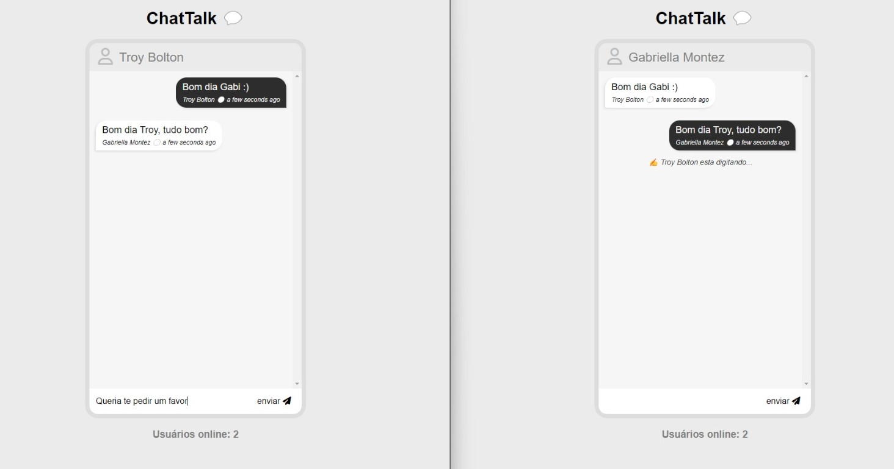

# Group-Talk

Uma sala de bate-papo ao vivo utilizando node + express e socket.io 

## Visite o Site

O site está atualmente hospedado na **** e pode ser acessado através do seguinte link:

* https://www.exemplo.com




### Funcionalidades

- A interface foi construída exclusivamente com CSS Flexbox, dispensando o uso de bibliotecas externas
- Utilizei a biblioteca Socket.IO para simplificar a implementação de WebSockets
- É possível renomear o nome de usuário

### Melhorias além do proposto no tutorial

- Responsividade mínima para Telas Mobile: O website é minimamente responsivo, proporcionando uma experiência agradavel em dispositivos móveis
- Revisão de Código: Boas praticas, remoção de conteudo não utilizado e adição de comentários pertinentes.
- Hospedagem online na ***

### Bibliotecas utilizadas

- [node.js](https://nodejs.org/en)
- [nodemon](https://www.npmjs.com/package/nodemon)
- [express](https://expressjs.com/pt-br/)
- [socket.IO](https://socket.io/)

## Como Instalar e Executar o Projeto na Sua Máquina

### Passo 1 - Requisitos

Você vai precisar de:

- [git](https://git-scm.com/)
- [node.js](https://nodejs.org/en)
- [npm packages](https://www.npmjs.com/)

### Passo 2 - Clone o repositório

```sh
$ git clone https://github.com/mylenaverspeelt/group-talk.git
```

### Passo 3 - Rode a aplicação

- Certifique de estar na pasta raiz do projeto

```sh
cd group-talk
```
- Instale as  as dependências do projeto

```sh
npm install
```

- Inicie o servidor Node com o Nodemon

```sh
npm run dev
```

O projeto estará disponível em localhost:4000

### Links originais

Este projeto foi desenvolvido com base no tutorial oferecido pela MafiaCodes. Você pode assistir e acessar o repositorio original nos seguintes links:

- https://www.youtube.com/watch?v=RUL9yTzOTuU&list=PLdHg5T0SNpN09AlLBAYahKZUrAWsIL7No
- https://github.com/trulymittal/chat-socket.io

